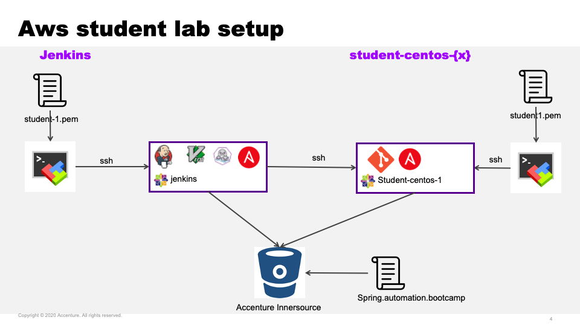

## Automation Bootcamp Source Code & Examples 

This Project holds the source code and examples of our provided automation bootcamp. We have different modules included and every module it self will have some examples and descriptions how to use. 

The content is for beginners in infrastructure automation and covers the topics:
- git
- ansible
- jenkins 
- terraform

You can try it out by yourself, but we recommend to join our trainings session and the automation tribe.

## Requirements

The requirements are depending on what kind of trainings module you want to run and you wanna try out. You will find a detailed description on the required tools and prerequisits in the module section. For the current course everything will be installed on the Jenkins or student machines and can be executed. 

### Course reuqirements
- MobaXterm or Putty
- ssh-keys to access the machines
- target ip's for Jenkins and student machine  

On a windows machine you need to download a ssh-client like MobXterm or Putty. We will provide you the ssh-keys to access the student machine and the Jenkins server with your Account. The addresses of the machines will change every day and we will provid your actual machine address in the morning.

## Usage
You can navigate to the modules and you will find example code and exercises which you can do by your own. For the current AutomationBootcamp we have a cloud setup with AWS. The Git remote repo we are using depends on the current use case and will be Innersource or your personal Github. The Jenkins server will provided centralized and you could login with your credentials.

### Our current environment on AWS
The setup of the current environment looks like the picture:



You can access with your notebook directly the Jenkins server and the your own student machine. To login into the machine you need to provide your student-x user and the distribued ssh-key.

### Current user mapping for AWS
For the current bootcamp we have the following order:

Student Name | Student User
------------ | -------------


### Get the Project on your machine
If you want to get the code on your trainings machine you should do the following things with the provided credentials:

Example:

Create a project folder
```
mkdir infra_automation
```

The environment will be spawned every day. So you need to check the [Inventory](../inventory)

You need to find the following informations:
- jenkins
- name_student-centos-{n - 1}

Connect to the Jenkins server ip with ssh (via MobaXterm f.e.).
- user: student-{n}
- ssh-key: student-{n}

You could reach you student machine `name_student-centos-{n - 1}` via ssh as well with:
- user: student-{n}
- ssh-key: student-{n}

If you are connected the Jenkins server you could check out the Code:
```
[student-2@ip-172-31-35-110 ~]$ eval $(ssh-agent)
Agent pid 87022
[student-2@ip-172-31-35-110 ~]$ ssh-add ~/.ssh/bitbucket
Identity added: /home/student-2/.ssh/bitbucket (/home/student-2/.ssh/bitbucket)
```
Switch to your project project directory:
```
cd infra_automation
git clone ssh://git@innersource.accenture.com/asgiac/spring.automation.bootcamp.git
```
### Trainings Modules
You could navgiate to the seperate Trainings Modules.
- [git](git/)
- [ansible](ansible/)
- [jenkins](jenkins/)
- [terraform](https://hashicorp.github.io/field-workshops-terraform/slides/aws/terraform-oss/index.html#1)

## Author(s) and Contacts

- [Sebastian Eidner](http://www.acccenture.com/) | [e-mail](mailto:sebastian.eidner@accenture.com)


